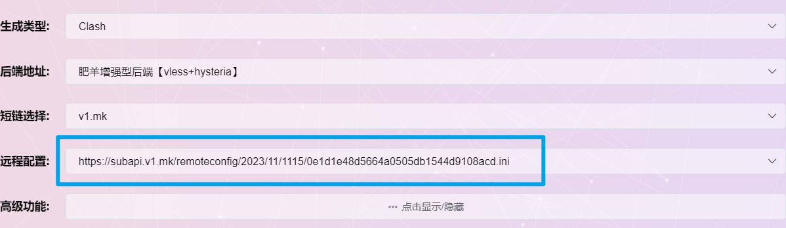

# 介绍

自己经常用的分流网站都没有添加bing、openAI的规则，为了方便自己使用bing和chatGPT，新增了上述2者的分流规则，除此外，使用过程中逐步更新了学术网站等内容。

# 使用方法

ACL4SSR订阅转换

1. 以我常用的“[ACL4SSR在线订阅转换](https://acl4ssr-sub.github.io/)”为例
2. 点击“进阶模式”
3. 导入订阅链接（机场、自建的），参考我的机场：[机场测评](airport.md)
4. 远程配置把这个仓库里面的“.ini”结尾的文件[地址](https://raw.githubusercontent.com/deardeer7/custom-clash-rules/main/custom%20rules.ini)填上去
5. 转换导入clash即可~

肥羊订阅转换

1. 以[肥羊订阅转换](https://suburl.v1.mk/)为例，进入转换界面，填入订阅链接（机场或自建）参考我的机场：[机场测评](airport.md)
2. 点击`自定义配置`
3. 同时打开仓库里面的“.ini”结尾的文件[地址](https://raw.githubusercontent.com/deardeer7/custom-clash-rules/main/custom%20rules.ini)，复制**文件内容**，粘贴到`远程配置文件上传`页面中
4. 检查`远程配置`，如图则成功
5. 根据自己偏好配置其他选项，生成订阅链接（ps: 网站支持自定义短链接后缀）
6. 导入clash即可~~

# 更新日志
2024/7/2 更新GTP规则列表，并将Gemini和Copilot合并在其中；新增Github和IP归属地伪装分流；新增“故障转移”分组

2024/5/18 重命名订阅类别为 `限量`和`限时`，注意节点分类规则仅仅适用于[我的机场](airport.md)

2024/3/18 更新节点分组名称，如香港 -> 小香港，美国 -> 小美国等，其他节点分组名称不变

2024/3/14 更新GPT节点规则，更新direct规则

2023/12/27 调整md内容，目前发现肥羊订阅疑似存在：转换的订阅在更新时无法加载本仓库新加的rule，todo

2023/11/17 更新：恢复bing分流

2023/11/15 更新：ACL4SSR订阅转换疑似出现bug，自动更新后丢失自定义规则，更换订阅转换网站；针对魔戒GPT节点更新rule。

2023/9/14 更新：修复Claude AI规则。

2023/9/4 更新：新增Claude AI规则（分流到除HK外的proxies），其他更规则更新。

2023/6/26 更新：合并两个机场订阅定制，精简规则
